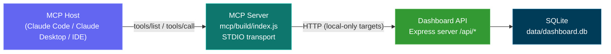
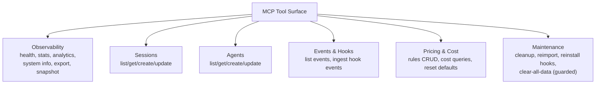
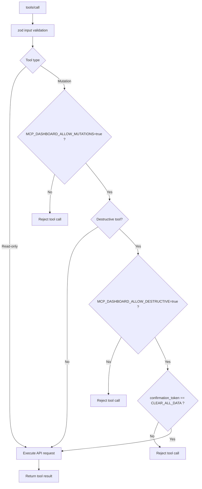
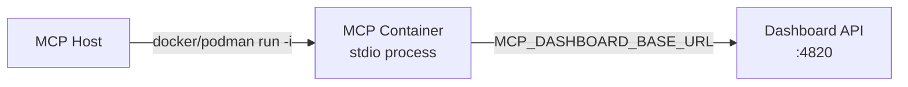
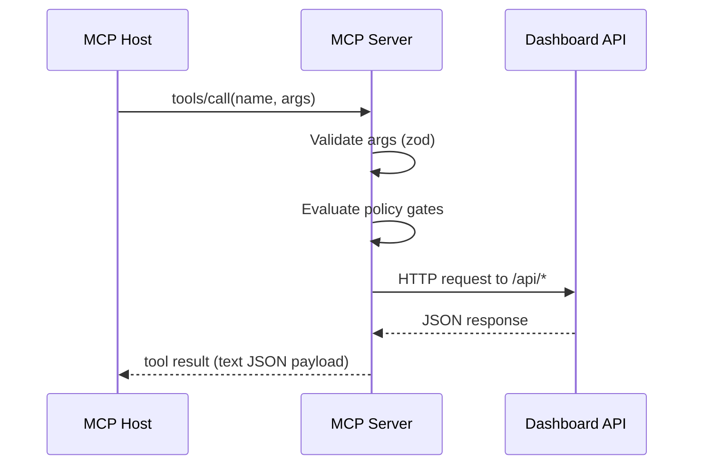
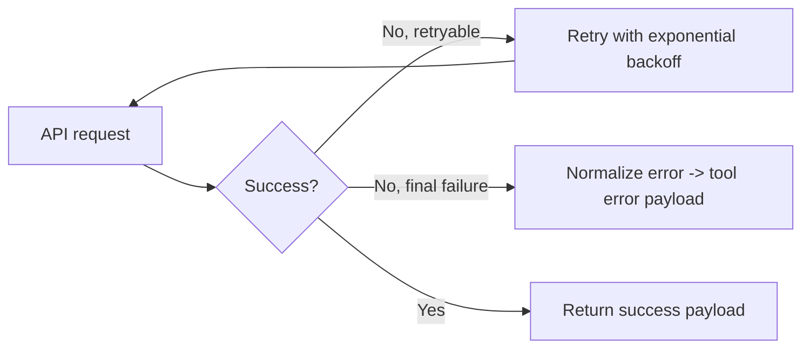

# Agent Dashboard MCP Server

Local, enterprise-grade Model Context Protocol (MCP) server for this repository.

It exposes the existing dashboard backend (`/api/*`) as MCP tools for Claude Code, Claude Desktop, and other MCP hosts.

## Table of Contents

- [Overview](#overview)
- [Runtime Architecture](#runtime-architecture)
- [Tool Domains](#tool-domains)
- [Safety and Control Model](#safety-and-control-model)
- [Prerequisites](#prerequisites)
- [Setup and Commands](#setup-and-commands)
- [Container Runtime (Docker / Podman)](#container-runtime-docker--podman)
- [Host Configuration](#host-configuration)
- [Configuration Variables](#configuration-variables)
- [Enterprise File Structure](#enterprise-file-structure)
- [Execution Flows](#execution-flows)
- [Operational Runbook](#operational-runbook)
- [Troubleshooting](#troubleshooting)

## Overview

The MCP server is a local stdio process that:

- receives `tools/list` and `tools/call` from an MCP host
- validates tool inputs with zod
- calls the local dashboard API (`http://127.0.0.1:4820/api/*` by default)
- returns structured tool results
- applies strict mutation/destructive guardrails

## Runtime Architecture



## Tool Domains



Read-focused tools:

- `dashboard_health_check`
- `dashboard_get_stats`
- `dashboard_get_analytics`
- `dashboard_get_system_info`
- `dashboard_export_data`
- `dashboard_get_operational_snapshot`
- `dashboard_list_sessions`
- `dashboard_get_session`
- `dashboard_list_agents`
- `dashboard_get_agent`
- `dashboard_list_events`
- `dashboard_get_pricing_rules`
- `dashboard_get_total_cost`
- `dashboard_get_session_cost`

Mutation tools (require `MCP_DASHBOARD_ALLOW_MUTATIONS=true`):

- `dashboard_create_session`
- `dashboard_update_session`
- `dashboard_create_agent`
- `dashboard_update_agent`
- `dashboard_ingest_hook_event`
- `dashboard_upsert_pricing_rule`
- `dashboard_delete_pricing_rule`
- `dashboard_reset_pricing_defaults`
- `dashboard_cleanup_data`
- `dashboard_reimport_history`
- `dashboard_reinstall_hooks`

Destructive tools (require mutation flag + destructive flag):

- `dashboard_clear_all_data`
  - requires `confirmation_token` exactly `CLEAR_ALL_DATA`

## Safety and Control Model



Core controls:

- Local dashboard host enforcement (`localhost`, `127.0.0.1`, `::1`, `host.docker.internal`, `gateway.docker.internal`, `host.containers.internal`)
- Strict schema validation per tool
- Centralized mutation/destructive policy gates
- Retry/backoff and timeout for resilient API calls
- Structured stderr logging only (stdio-safe)

## Prerequisites

- Node.js `>= 18.18.0`
- Dashboard server running:
  - dev: `npm run dev`
  - prod: `npm run build && npm start`

## Setup and Commands

Recommended from repository root:

```bash
npm run mcp:install
npm run mcp:build
npm run mcp:start
```

Alternative from `mcp/` directly:

```bash
cd mcp
npm install
npm run build
npm start
```

Available scripts:

- `npm run mcp:install`
- `npm run mcp:build`
- `npm run mcp:start`
- `npm run mcp:dev`
- `npm run mcp:typecheck`
- `npm run mcp:docker:build` (from repo root)
- `npm run mcp:podman:build` (from repo root)
- `npm --prefix mcp run docker:build` (from repo root)
- `npm --prefix mcp run podman:build` (from repo root)

## Container Runtime (Docker / Podman)

The MCP server uses stdio transport. In containers, it should run as a short-lived interactive process
(`-i`) that your MCP host launches on demand.

Build from repository root:

```bash
# Docker
npm run mcp:docker:build

# Podman
npm run mcp:podman:build
```

Manual build commands:

```bash
# Docker (repo root)
docker build -f mcp/Dockerfile -t agent-dashboard-mcp:local .

# Podman (repo root)
podman build -f mcp/Dockerfile -t localhost/agent-dashboard-mcp:local .
```

Container networking options:



Recommended runtime patterns:

```bash
# Docker bridge network, map host alias explicitly
docker run --rm -i --init \
  --add-host=host.docker.internal:host-gateway \
  -e MCP_DASHBOARD_BASE_URL=http://host.docker.internal:4820 \
  agent-dashboard-mcp:local

# Podman host network (Linux/rootless): keep loopback URL
podman run --rm -i --network=host \
  -e MCP_DASHBOARD_BASE_URL=http://127.0.0.1:4820 \
  localhost/agent-dashboard-mcp:local

# Podman bridge mode: use built-in host alias
podman run --rm -i \
  -e MCP_DASHBOARD_BASE_URL=http://host.containers.internal:4820 \
  localhost/agent-dashboard-mcp:local
```

## Host Configuration

### Direct Node runtime (recommended for local development)

Example MCP host config (Windows path style):

```json
{
  "mcpServers": {
    "agent-dashboard": {
      "command": "node",
      "args": [
        "C:\\ABSOLUTE\\PATH\\TO\\Claude-Code-Agent-Monitor\\mcp\\build\\index.js"
      ],
      "env": {
        "MCP_DASHBOARD_BASE_URL": "http://127.0.0.1:4820",
        "MCP_DASHBOARD_ALLOW_MUTATIONS": "false",
        "MCP_DASHBOARD_ALLOW_DESTRUCTIVE": "false",
        "MCP_LOG_LEVEL": "info"
      }
    }
  }
}
```

For macOS/Linux, use POSIX paths in `args`.

### Docker runtime wrapper

```json
{
  "mcpServers": {
    "agent-dashboard": {
      "command": "docker",
      "args": [
        "run",
        "--rm",
        "-i",
        "--init",
        "--add-host=host.docker.internal:host-gateway",
        "-e",
        "MCP_DASHBOARD_BASE_URL=http://host.docker.internal:4820",
        "agent-dashboard-mcp:local"
      ],
      "env": {
        "MCP_DASHBOARD_ALLOW_MUTATIONS": "false",
        "MCP_DASHBOARD_ALLOW_DESTRUCTIVE": "false",
        "MCP_LOG_LEVEL": "info"
      }
    }
  }
}
```

### Podman runtime wrapper

```json
{
  "mcpServers": {
    "agent-dashboard": {
      "command": "podman",
      "args": [
        "run",
        "--rm",
        "-i",
        "--network=host",
        "localhost/agent-dashboard-mcp:local"
      ],
      "env": {
        "MCP_DASHBOARD_BASE_URL": "http://127.0.0.1:4820",
        "MCP_DASHBOARD_ALLOW_MUTATIONS": "false",
        "MCP_DASHBOARD_ALLOW_DESTRUCTIVE": "false",
        "MCP_LOG_LEVEL": "info"
      }
    }
  }
}
```

## Configuration Variables

| Variable | Default | Description |
| --- | --- | --- |
| `MCP_SERVER_NAME` | `agent-dashboard-mcp` | MCP server name reported to host |
| `MCP_SERVER_VERSION` | `1.0.0` | MCP server version |
| `MCP_DASHBOARD_BASE_URL` | `http://127.0.0.1:4820` | Dashboard API base URL (must be local-only hostname; supports loopback and container host aliases) |
| `MCP_DASHBOARD_TIMEOUT_MS` | `10000` | API timeout per request |
| `MCP_DASHBOARD_RETRY_COUNT` | `2` | Retries for idempotent requests |
| `MCP_DASHBOARD_RETRY_BACKOFF_MS` | `250` | Exponential retry backoff base |
| `MCP_DASHBOARD_ALLOW_MUTATIONS` | `false` | Enables mutating tools |
| `MCP_DASHBOARD_ALLOW_DESTRUCTIVE` | `false` | Enables destructive tools (requires mutations) |
| `MCP_LOG_LEVEL` | `info` | `debug`, `info`, `warn`, `error` |

Reference file: `mcp/.env.example`

## Enterprise File Structure

```text
mcp/
  src/
    clients/
      dashboard-api-client.ts
    config/
      app-config.ts
    core/
      logger.ts
      tool-registry.ts
      tool-result.ts
    policy/
      tool-guards.ts
    tools/
      schemas.ts
      domains/
        observability-tools.ts
        session-tools.ts
        agent-tools.ts
        event-tools.ts
        pricing-tools.ts
        maintenance-tools.ts
      index.ts
    types/
      tool-context.ts
    server.ts
    index.ts
  build/
  Dockerfile
  package.json
  tsconfig.json
```

## Execution Flows

Tool execution flow:



Failure handling:



## Operational Runbook

Read-only daily usage:

1. Start dashboard (`npm run dev` or `npm start`)
2. Start MCP (`npm run mcp:start`)
3. Keep mutation flags disabled

Admin workflow:

1. Set `MCP_DASHBOARD_ALLOW_MUTATIONS=true`
2. Run required maintenance tools
3. Revert mutation flag to `false`

High-risk workflow:

1. Set both mutation and destructive flags to `true`
2. Use destructive tool with explicit confirmation token
3. Disable destructive mode immediately after operation

## Troubleshooting

1. Tools fail with connection error
   - Verify dashboard is reachable at `MCP_DASHBOARD_BASE_URL`
   - Verify `GET /api/health` works
2. Mutation tools denied
   - Set `MCP_DASHBOARD_ALLOW_MUTATIONS=true`
3. Destructive tool denied
   - Set `MCP_DASHBOARD_ALLOW_DESTRUCTIVE=true`
   - Pass `confirmation_token: "CLEAR_ALL_DATA"`
4. Host cannot start MCP
   - Confirm absolute path to `mcp/build/index.js`
   - Rebuild: `npm run mcp:build`
5. Docker runtime cannot reach dashboard
   - Use Docker host alias + `--add-host=host.docker.internal:host-gateway`
   - Set `MCP_DASHBOARD_BASE_URL=http://host.docker.internal:4820`
6. Podman runtime cannot reach dashboard
   - Prefer `--network=host` with `MCP_DASHBOARD_BASE_URL=http://127.0.0.1:4820`
   - For bridge mode, use `MCP_DASHBOARD_BASE_URL=http://host.containers.internal:4820`
7. Container image build fails
   - Build from repository root so `file:..` dependency resolves
   - Use `docker build -f mcp/Dockerfile ... .` or `podman build -f mcp/Dockerfile ... .`
